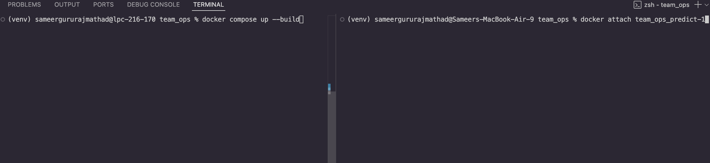
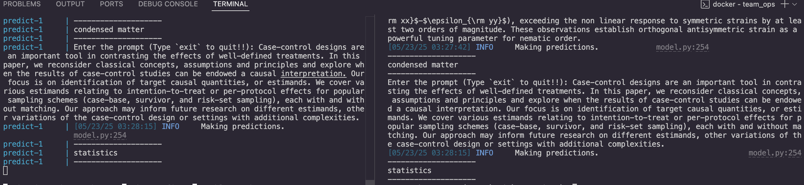

# team_ops

# Containerization
# ----------------
We created two images for this phase as required by the project. The first image is for the training and the second one is for the prediction. These images can be found in the `dockerfiles/` directory. *train_model.dockerfile* is used to create the training image and *predict_model.dockerfile* is used to create the prediction image.

## Docker Compose
We have also specified a docker-compose file present in the root directory of the project. This file has three services defined. First, is train to run the training image, second is to run prediction image and third is to run prometheus for monitoring the inference service.
To run this file, make sure docker is running and then run the following command in the root directory of the project:

```bash
docker compose up --build # To build the image first time

# or - This depends on your docker version

docker-compose up --build # To build the image first time
```

### To run inference:
```bash
docker attach <container_name>
```

Find this  attached to follow how to run the images.

### Inference results:


