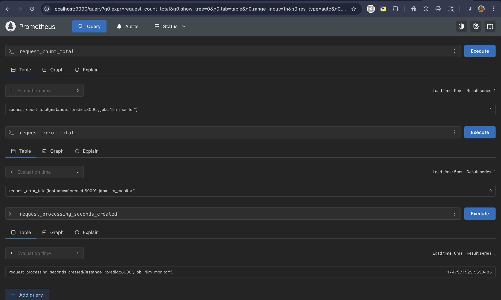

# team_ops

# Containerization
We created two images for this phase as required by the project. The first image is for the training and the second one is for the prediction. These images can be found in the `dockerfiles/` directory. *train_model.dockerfile* is used to create the training image and *predict_model.dockerfile* is used to create the prediction image.

## Docker Compose
We have also specified a docker-compose file present in the root directory of the project. This file has three services defined. First, is train to run the training image, second is to run prediction image and third is to run prometheus for monitoring the inference service.
To run this file, make sure docker is running and then run the following command in the root directory of the project:

```bash
docker compose up --build # To build the image first time

# or - This depends on your docker version

docker-compose up --build # To build the image first time
```

### To run inference:
```bash
docker attach <container_name>
```
### To stop the container:

```bash
docker compose down # To build the image first time

# or - This depends on your docker version

docker-compose down # To build the image first time
```

### Find this attached to follow how to run the images.


### Inference results:


## Bash
We can also run the images using bash commands. To build the images, run the following command in the root directory of the project
@note: This won't run the prometheus service, as with docker compose.
```bash

### Train Model
```bash
docker build -t train_model -f dockerfiles/train_model.dockerfile .
docker run train_model
```

### Predict Model
```bash
docker build -t predict_model -f dockerfiles/predict_model.dockerfile .
docker run -it predict_model # stdin for taking input.
```

# Debugging Practices
For this phase, we have used prometheus for monitoring the inference service. We have added support for total requests, errors and time taken for each request at the moment. We have added a yaml file for prometheus configuration. This file is present in the `yaml/` directory. By default, prometheus runs on port 9090. This is setup in the docker-compose file itself. To access the prometheus dashboard, open your browser and go to `http://localhost:9090/`.

### Example of the prometheus dashboard:



### Example of the prometheus graph:


# Profiling
We have used the cProfile and pstats module to profile the code. We did not add profiling for pytorch as we are not directly using it. We are using huggingface transformers library supports both pytorch and tensorflow. Alos, we added profiling in predict_model.py and train_model.py.
and the results are printed in the console itself.

### Example of the profiling results:
```bash
    1358685 function calls (1314074 primitive calls) in 227.359 seconds

   Ordered by: cumulative time
   List reduced from 3564 to 25 due to restriction <25>

   ncalls  tottime  percall  cumtime  percall filename:lineno(function)
        1    0.000    0.000  227.364  227.364 <decorator-gen-1>:1(inference)
        1    0.120    0.120  227.364  227.364 /usr/local/lib/python3.11/site-packages/prometheus_client/context_managers.py:76(wrapped)
        1    0.001    0.001  227.244  227.244 /app/team_ops/predict_model.py:13(inference)
        5  213.720   42.744  213.720   42.744 {built-in method builtins.input}
        1    0.000    0.000   13.083   13.083 /usr/local/lib/python3.11/site-packages/team_ops/model.py:35(__init__)
       15    0.000    0.000   12.009    0.801 /usr/local/lib/python3.11/site-packages/transformers/utils/hub.py:208(cached_file)
       15    0.000    0.000   12.009    0.801 /usr/local/lib/python3.11/site-packages/transformers/utils/hub.py:271(cached_files)
    82/32    0.000    0.000   12.008    0.375 /usr/local/lib/python3.11/site-packages/huggingface_hub/utils/_validators.py:98(_inner_fn)
        9    0.000    0.000   12.006    1.334 /usr/local/lib/python3.11/site-packages/huggingface_hub/file_download.py:809(hf_hub_download)
        9    0.000    0.000   12.006    1.334 /usr/local/lib/python3.11/site-packages/huggingface_hub/file_download.py:1028(_hf_hub_download_to_cache_dir)
    16924    0.031    0.000   11.630    0.001 /usr/local/lib/python3.11/socket.py:704(readinto)
    16924    0.044    0.000   11.581    0.001 /usr/local/lib/python3.11/ssl.py:1299(recv_into)
    16924    0.019    0.000   11.533    0.001 /usr/local/lib/python3.11/ssl.py:1157(read)
    16924   11.513    0.001   11.513    0.001 {method 'read' of '_ssl._SSLSocket' objects}
        5    0.001    0.000   11.079    2.216 /usr/local/lib/python3.11/site-packages/huggingface_hub/file_download.py:1653(_download_to_tmp_and_move)
        5    0.001    0.000   11.072    2.214 /usr/local/lib/python3.11/site-packages/huggingface_hub/file_download.py:343(http_get)
        2    0.000    0.000   10.969    5.485 /usr/local/lib/python3.11/site-packages/transformers/models/auto/auto_factory.py:452(from_pretrained)
        2    0.000    0.000   10.865    5.433 /usr/local/lib/python3.11/site-packages/transformers/modeling_utils.py:275(_wrapper)
        2    0.001    0.000   10.865    5.432 /usr/local/lib/python3.11/site-packages/transformers/modeling_utils.py:3735(from_pretrained)
        2    0.000    0.000   10.806    5.403 /usr/local/lib/python3.11/site-packages/transformers/modeling_utils.py:858(_get_resolved_checkpoint_files)
       55    0.000    0.000   10.403    0.189 /usr/local/lib/python3.11/site-packages/requests/models.py:816(generate)
       55    0.000    0.000   10.403    0.189 /usr/local/lib/python3.11/site-packages/urllib3/response.py:1044(stream)
       47    0.001    0.000   10.403    0.221 /usr/local/lib/python3.11/site-packages/urllib3/response.py:916(read)
       54    0.001    0.000   10.361    0.192 /usr/local/lib/python3.11/site-packages/urllib3/response.py:864(_raw_read)
       54    0.000    0.000   10.355    0.192 /usr/local/lib/python3.11/site-packages/urllib3/response.py:807(_fp_read)
```

# Application and logging experiments.
We have used `mlflow` for logging the experiments. We have added support while training the model and log appropriate metrics. The logs are saved in the directory user provides in the config file. The default port is 5000. To access the mlflow dashboard, open your browser and go to `http://localhost:5000/`. You can also run the following command to see the logs in the terminal.

```bash
mlflow ui --backend-store-uri <your_mlflow_directory>
```

### Example of the mlflow dashboard:


### Example of the mlflow graph:


# Logging setup
We have used `logging` module for logging. We have both basic and advanced logging with rich setup. We have created a class called custom_logger.py for this. We have added support for logging to a file and also to the console. The logs are saved in the directory user provides in the config file. The default log level is INFO. You can change it to DEBUG or ERROR as per your requirement. The logs are saved in the `logs` directory for *info* level. The default log level is INFO. You can change it to DEBUG or ERROR as per your requirement.

### Example of the logging output:


# Hydra setup
We had used `hydra-core` during last phase for configuration management. The setup can be found in HConfig.py. By default, hydra looks for conf folder and config.yaml file. User can change experiments under defaults section. An example can be found in the team_ops directory.

### Example of the hydra config:
```yaml
defaults:
  - experiments: exp1
```

### Experiment config example:
```yaml
model:
  pretrained_model: 'distilbert/distilbert-base-uncased'

data:
  # This path provided was tested on dockerfile. Testing locally would require you
  # to copy actual path to the data folder.
  path: 'data/processed/processed_dataset.csv' # Path to the processed dataset.
  feature: 'text'
  label: 'label'
  target: 'target'
  drop_target: True
  train_ratio: 40_000

train:
  output_path: 'models' # Path to save the trained model
  model_name: 'model_1' # Change the name of the model as needed.
  learning_rate: 2e-5
  per_device_train_batch_size: 8
  per_device_eval_batch_size: 8
  num_train_epochs: 2
  weight_decay: 0.01
  eval_strategy: 'epoch'
  save_strategy: 'epoch'
  load_best_model_at_end: True
  push_to_hub: False
  # Set this to true if you want to retrain even though you have a trained model.
  force_train: False

mlflow:
  tracking_uri: '/home/smathad/se-489/mlfow' # Set your path accordingly.
  experiment_name: 'team_ops_v1'
  run_name: 'model_1'
```
