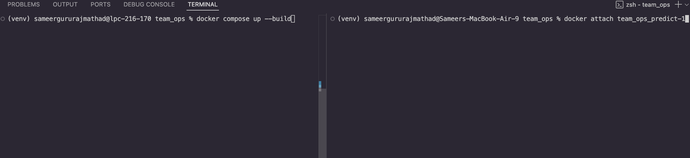
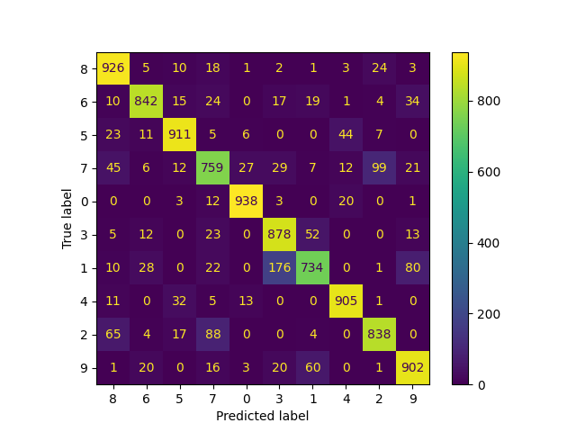

## Scientific Text Classification using LLMs

## Team Ops

This is a collaborative project to build a scientific text classification model using LLMs. The project is divided into different phases, each focusing on a specific aspect of the model development. The project is hosted on GitHub and the code is available for public use.

- Authors:
  - [@sameera-g-mathad] Sameer Gururaj Mathad (smathad@depaul.edu)
  - [@Mavudiya] Mahendra AVUDIYAPPAN (mavudiya@depaul.edu)

## Project Highlights:

- Goal:

  - ✅ The main goal of this project is to build and train llm for text classification tasks.
  - ✅ Create a website for users to enter prompt and get predictions back easily. Deploy the frontend app on huggingface.
  - ✅ Use of versioning tools like `git` for codebase and `dvc` for managing data and model in remote storage of choice. Use tools like pre-commit to verify commits before pushing code into github.
  - ✅ Use logging to store logs and display every level of information and tools like hydra to manage experiment tracking.
  - ✅ Track metrics and experiments with tools like prometheus and mlflow.
  - ✅ Create docker images and make it publically available on dockerhub. Can use the same image for deployment as well.
  - ✅ Create a backend server to serve user requests and deploy it on Google Cloud Platform (GCP).
  - ✅ Create workflows that run automatically and provide appropriate results. This includes testing the application for various test case, training model on the go to test its performance using tools like Continuous Machine Learning, and yaml files for gcp to automatically build images.
  - ✅ Create Artifacts using GCP and also deploy images on GCP cloud run.

- Architecture:

  - Use of streamlit for building frontend web app and host it on huggingface.
  - Use of python libraries such as transformers offered by huggingface for training model.
  - Creation of fastAPI server for serving requests during inference.
  - Use GCP for continous deployment of the server.

## Project Overview

The goal of this project is to build a scientific text classification model using LLMs. We intend to use the [“knowledgator/Scientific-text-classification"](https://huggingface.co/datasets/knowledgator/Scientific-text-classification) dataset hosted on Hugging-Face. This dataset contains two columns [‘text’, ‘label’], that are self-explanatory. There are 78,631 instances, out of which we plan to use 50,000 subsets. There are 28,641 unique class labels in this dataset. Our focus however is on [statistics, quantum physics, physics, mathematics, high energy physics theory, high energy physics phenomenology, electrical engineering and systems science, condensed matter, computer science, astrophysics] class labels as their distribution and frequency is higher than 4000, and the remaining class labels appear only once in the dataset which is not ideal for training.

## DataSet

We use [“knowledgator/Scientific-text-classification"](https://huggingface.co/datasets/knowledgator/Scientific-text-classification) dataset hosted on Hugging-Face. This dataset contains two columns [‘text’, ‘label’], that are self-explanatory. There are 78,631 instances, out of which we plan to use 50,000 subsets. There are 28,641 unique class labels in this dataset. Our focus however is on [statistics, quantum physics, physics, mathematics, high energy physics theory, high energy physics phenomenology, electrical engineering and systems science, condensed matter, computer science, astrophysics] class labels as their distribution and frequency is higher than 4000, and the remaining class labels appear only once in the dataset which is not ideal for training.

## Models

We are using 'distilbert/distilbert-base-uncased' as of now, which has 66 million parameters. Using hugging-face, which swaps the last embedding layer with classification head.

## Our frontend application exmaple:


## Setup Instructions

Start by cloning the repository:

```bash
git clone https://github.com/sameera-g-mathad/SE-489_TeamOps.git

cd team_ops
```

Then, create a virtual environment and activate it:

```bash
python3 -m venv .venv
source .venv/bin/activate
```

Then, install the dependencies:

## To install the dependencies, this is needed to run the project.

```bash
make install
```

Select the testing_model.ipybook and run the cells to train the model. The model will be saved in the models directory.

To update the dependencies in requirements.txt, run:

```bash
make pipreqs
```

To check for any errors in the code, run:

```bash
make ruff
```

The code we used to build the model is in /notebooks directory. We have provided the yaml files to run the model. The config files are used to set the parameters for the model, such as learning rate, batch size, number of epochs, etc. The config files are used in the training and prediction scripts. Plase change the directory paths in the config files to match your directory structure. The config files are used in the training and prediction scripts. This file will be updated as we progress in the project.

## Data

We have created s3 bucket to store data and models. The keys are not available to everyone. It is the user responsibility to create the s3 bucket and add the keys in .env file.

- To push the data to s3 bucket, run the following command:

```bash
dotenv run -- dvc push -u data-remote
```

- To pull the data from s3 bucket, run the following command:

```bash
dotenv run -- dvc pull -u data-remote
```

- To push the model to s3 bucket, run the following command:

```bash
dotenv run -- dvc push -u model-remote
```

- To pull the model from s3 bucket, run the following command:

```bash
dotenv run -- dvc pull -u model-remote
```

- To build models using docker images and docker compose. (Note: .env file is needed for the images to run properly.)

```bash
docker compose up --build # To build the image first time

# or - This depends on your docker version

docker-compose up --build # To build the image first time
```

### To run inference:

```bash
docker attach <container_name>
```

### To stop the container:

```bash
docker compose down # To build the image first time

# or - This depends on your docker version

docker-compose down # To build the image first time
```

### Find this attached to follow how to run the images.



- To run tests, one can use commands configured in Makefile

```bash
make test_data # To test data.

make test_train # To test the training phase.

make test_inference # To test the inference phase.

make test_all # To test all the above test cases.
```

## Can download or view frontend files from [huggingface spaces](https://huggingface.co/spaces/MahiJaga/team_ops_frontend).

## Github workflows can be found under `.git/workflows` that run specific actions on code push to main branch.

It is the user responsibility to create secrets variables that are needed by the actions to run properly. This include aws keys for pushing and pulling data and model, dockerhub details like username, passoword or token and personal access token specifically needed by CML for modifying and publishing comments inside the repository. Please refer the below image for example.


## To run a server instance locally.

To run the fastAPI server locally, we can use the dockerfile present under the dockerfiles/server.dockerfile.

```bash
docker build -f dockerfiles/server.dockerfile -t server_api . # Build image

docker run -p 8081:8081 server_api # Run the server.

```

## To test the model against test data:

```bash
python team_ops/models/eval.py
```

#### Example confusion matrix:



## Deploy containers into GCP

This part requires creating a dockerfile, in our case it is `dockerfiles/server.dockerfile` and create a yaml namely `cloudbuild.yaml` to instruct gcp to pull and create new images by watching our repository. This requiers creating a artifact that watches our github repository. This would be needed when building gcp cloud run service that uses the image created, in our case the server image and creates an container out of it. This is a automatic process and the deployed server can be used from any application. We tested the created backend api through our frontend streamlit app and postman.

_Note:Refer to online resources or gcp documentation for detailed explanation._

## Contributions

- [@sameera-g-mathad] Sameer Gururaj Mathad - Responsible for the overall project management and coordination from creation to updating readme files. Trained the model and created the config files. Also created s3 bucket to store the data and models and configured the dvc to push the data and models to s3 bucket. Created dockerfiles for training, inference and server also adding features like prometheus, pytests and also handled the gcp deployment orchestation.

- [@Mavudiya] Mahendra AVUDIYAPPAN - Responsible for processing the data and creating a trainable processed dataset. Also, created the frontend app using streamlit and published the website on huggingface spaces.

## References

Please refer the requirements.txt and requirements_manual.txt files for the list of dependencies used in the project. The requirements.txt file is used to install the dependencies using pip. The requirements_manual.txt file is used to install the dependencies manually. These are the dependencies that are required by the main libraries used in the project. Transformers is the main library that has support for fine-tuning the model provided by Hugging Face.

- Third party libraries used in the project:

  - [transformers](https://huggingface.co/docs/transformers/index)
  - [datasets](https://huggingface.co/docs/datasets/index)
  - [dvc](https://dvc.org/doc/start)
  - [dotenv](https://pypi.org/project/python-dotenv/)
  - [hydra](https://hydra.cc/docs/intro/)
  - [pytorch](https://pytorch.org/get-started/locally/)
  - [scikit-learn](https://scikit-learn.org/stable/)
  - [numpy](https://numpy.org/)
  - [pandas](https://pandas.pydata.org/)
  - [pytest](https://docs.pytest.org/en/stable/)
  - [prometheus_client](http://github.com/prometheus/client_python)
  - [mlflow](https://mlflow.org/)
  - [streamlit](https://streamlit.io/)
  - [duckdb](https://duckdb.org/)
  - [rich](https://rich.readthedocs.io/en/stable/introduction.html)
  - [fastapi](http://fastapi.tiangolo.com/)

- Dataset
  - [“knowledgator/Scientific-text-classification"](https://huggingface.co/datasets/knowledgator/Scientific-text-classification)
